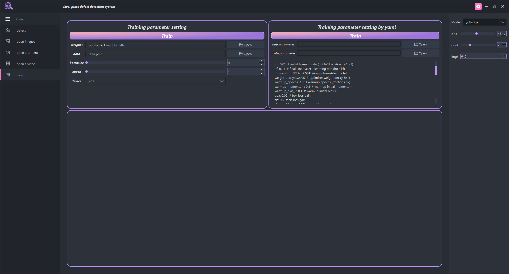

Here's the polished English version of your README content:

---

# GUI for Strip Detection

A small tool that provides a graphical interface for object detection tasks. The detection source can be set to a camera, a folder of images, a video file, or a single image. The interface displays the frame rate in real time.

You can adjust detection display settings in real time, including IoU and confidence thresholds.

The GUI also supports model training. Basic training hyperparameters can be configured directly through the interface, or you can define a YAML file for more advanced and comprehensive parameter settings.

## Run

```bash
python main.py
```

## Detection Interface




---

